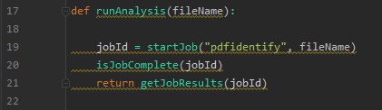

This guide will assume that the host machine is a Windows PC running both the web application and the python middleman server

# AWS Setup

* Register for an [Amazon Web Services account](https://aws.amazon.com/)
* Follow the ["Getting Started"](https://docs.aws.amazon.com/textract/latest/dg/setup-awscli-sdk.html) guide to set up the AWS CLI *AND* Python SDK (boto3)
* Create an S3 bucket titled "pdfidentify" to house all of the textract documents used with the library
  * If you choose to name this bucket something else, you will have to change the name of the bucket in the Python code
 
# Python Setup

* Ensure that you have an installation of Python 2.7 or newer from [Python.org](https://www.python.org/)
* If you named the bucket something other than "pdfidentify":
  * Change the string "pdfidentify" in line 19 of Python/TextractMiddleman.py to be the name of your bucket
  

* If you want to run the middleman service on a port other than 5003, change the 
* Use CMD to run TextractMiddleman.py, change the port parameter in line 81 to the desired port number
  * The sample WebApp uses port 5003 to communicate with the middleman server
  
# WebApp Setup

The source code of the PDFIdentify library is available in this repository. It is also available as a nuget package that can be installed to a local directory.

For instructions on the implementation of the library in an application, see the [implementation documentation]().

For the Sample WebApp:

* Ensure that the [.NET Core 2.1 Runtime and SDK](https://dotnet.microsoft.com/download/dotnet-core/2.1) are installed on the local machine
* Build and run the application using an IDE
* Open a web browser to the address of the webapp (likely "localhost:xxxx" where "xxxx" is the port number your machine has selected.
* Note: Since this is a session-based web application, some browsers will require you to trust cookies from the specified address manually in order for the system to work.

